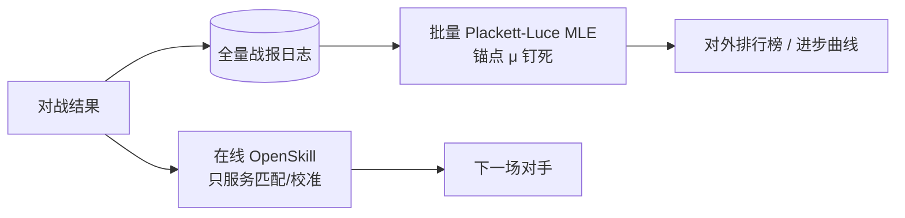

# Design B（grok）：LLM-snapshot 风格的「无漂移」方案（被审原文）

> **历史外部提案（原文粘贴，2026-09-25/26 审查）**：本文不是仓库设计；其
> `tau=0`、全量 PL-MLE 发布层与生命周期冻结等与仓库 seam 冲突，经收窄后的
> 方向已固化为 [`ADR-0013`](../docs/adr/0013-drift-free-rating-channel.md)
> （在线 seam 保留 + 独立 `mle.py` 发布表）；逐条裁决见 [`report.md`](./report.md)。

> 新模型混合标准 OpenSkill，按等级分 μ 和不确定度 σ 做匹配，再加全局对战。新模型怎么更新？旧模型怎么更新？才能既不分数漂移，又准确衡量模型是否在进步。

下面按这个问题，把无漂移系统精确落到可实现的设计上。

---

## 1. 这段对话在问什么

要评的是**不可变模型快照**（某个日期的 GPT / Claude / 自研 checkpoint），不是会变强的人类选手。系统有两件事必须同时成立：

| 目标 | 含义 | 一旦做错会怎样 |
|---|---|---|
| 相对排序准 | A 对 B 的胜率预测准 | 匹配崩、排行榜乱 |
| 绝对尺度稳 | 去年的 Claude-3-Opus 今天还是同一个 μ | 新模型一进场，旧模型集体“变弱”，你无法判断是真进步还是尺子在动 |

用户提的混合策略是对的：

- **局部匹配**：按 μ、σ 抽信息量大的对手（接近 50/50，且至少一方不确定）
- **全局对战**：强制打锚点 / 分层抽样，把绝对尺度钉住

真正要设计的是**写回规则**，不是 `rate()` 本身。

---

## 2. 漂移从哪来（必须对着公式改）

OpenSkill 默认 Plackett–Luce（Weng–Lin）对一支队伍：

\[
c=\sqrt{\sum_q(\sigma_q^2+\beta^2)},\quad
\Omega_q \propto \frac{\sigma_q^2}{c},\quad
\mu_i \leftarrow \mu_i + \frac{\sigma_i^2}{\sigma_q^2}\Omega_q
\]

三个直接后果：

1. **Δμ ∝ σ²，不是零和。** 高不确定的新模型赢了低不确定的旧模型：新模型涨很多，旧模型只掉一点，池子总 μ 上升。反过来也一样。这是分数膨胀/收缩的主因。
2. **默认 `tau = 25/300 ≈ 0.083`。** 每场赛前 `σ ← √(σ²+τ²)`。人类选手需要这个；**模型快照不需要**。τ>0 会让旧模型永远被新对局拽着走。
3. **在线更新有顺序依赖。** 同一组战报正序/倒序重放，排行榜会动。Chatbot Arena 因此从在线 Elo 改成了全量 Bradley–Terry MLE。

所以：**匹配可以用在线 OpenSkill；对外公布的“有没有进步”，不能只用在线 OpenSkill。**

---

## 3. 精确架构：两层 + 锚点



| 层 | 用途 | 是否允许漂移 |
|---|---|---|
| 在线 OpenSkill | 匹配、新模型校准、σ 收敛 | 允许，不对外 | 
| 批量 PL-MLE | 公布 μ、置信区间、跨时间比较 | 不允许：锚点钉死，Σμ 有约束 |

这是“精确”的第一原则：**匹配层和尺度层拆开。**

---

## 4. 模型生命周期和写回策略

每个模型四个状态：

| 状态 | 条件 | μ 写回 | σ 写回 |
|---|---|---|---|
| `probation` 新模型 | 入池，σ 大 | **全量** | 全量 |
| `established` 已收敛 | σ < σ\* 且对局 ≥ N\* | **不写 μ**（或只写 5–10% 阻尼） | 只允许 σ 下降 |
| `anchor` 尺度锚 | 3–5 个冻结快照 | **永不写** | 永不写 |
| `frozen` 退役快照 | 主动冻结的旧版本 | 永不写 | 永不写 |

推荐常数（静态模型）：

```text
mu0          = 25.0
sigma0       = 25/3 ≈ 8.333
beta         = 25/6 ≈ 4.167
tau          = 0            # 关键：关掉动态因子
kappa        = 1e-4
limit_sigma  = True
σ*           = 2.5          # 校准完成阈值
N*           = 40           # 最少校准场次
anchors      = 钉死的历史快照，例如 GPT-4-0314 / Claude-3-Opus / Llama-3-70B
```

**新模型先验不要盲用 25。** 同类家族用层级先验：

\[
\mu_{\text{new}} = \mu_{\text{family}},\quad
\sigma_{\text{new}} = \sqrt{\sigma_0^2 + \sigma_{\text{family}}^2}\;\text{或直接}\;\sigma_0
\]

否则一个明显强于 25 的 SOTA 会在高 σ 阶段向池子注入大量 μ。

---

## 5. 一场对局怎么更新（精确写回）

伪代码。核心：**`rate()` 一定要用双方当前 μ/σ 算，但旧模型的输出丢掉。**

```python
from openskill.models import PlackettLuce

model = PlackettLuce(
    mu=25.0, sigma=25/3, beta=25/6,
    tau=0.0,          # 静态快照
    kappa=1e-4,
    limit_sigma=True,
)

FROZEN = {"anchor", "frozen"}
DAMP_ESTABLISHED = 0.0   # 0 = 旧模型 μ 完全冻结

def commit_match(participants, ranks):
    """participants: list[Model], 1 人 1 队。ranks 越小越好。"""
    snapshot = [(m.mu, m.sigma) for m in participants]
    teams = [[model.rating(mu=m.mu, sigma=m.sigma)] for m in participants]
    updated = model.rate(teams, ranks=ranks)

    for m, (mu0, sig0), u in zip(participants, snapshot, updated):
        new_mu, new_sig = u[0].mu, u[0].sigma
        if m.status in FROZEN:
            continue                         # 尺子不动
        if m.status == "probation":
            m.mu, m.sigma = new_mu, new_sig  # 新模型全力学
        elif m.status == "established":
            m.mu = mu0 + DAMP_ESTABLISHED * (new_mu - mu0)
            m.sigma = min(sig0, new_sig)     # 只吸收信息，不改位置

    # 禁止：对含冻结玩家的对局做 Σμ 守恒
    # 守恒会把“新模型相对锚点的真实位移”再减回去
```

多模型同一编程题（按测例排名）直接走 Plackett–Luce 多队 `ranks`，不要拆成假 1v1——这正是 OpenSkill 相对 Elo 的优势。

**不要做的守恒：** 一场里有锚点时，把 μ 变化摊平。那样新模型永远绕着锚点抖，测不出进步。

**可以做的守恒：** 仅在“全是 probation”的内部热身赛里，减去本场平均 Δμ，避免新模型互相灌分。

---

## 6. 匹配：局部 OpenSkill + 强制全局

对一个待打的模型 \(A\)，对手 \(B\) 的抽样权重：

\[
w(B) =
\lambda_1\,\mathcal N(\mu_A-\mu_B;\,0,\,\beta^2)
+\lambda_2\,\sigma_B
+\lambda_3\,\mathbf 1[B\in\text{anchors}]
+\lambda_4\,\mathbf 1[\text{这对历史场次少}]
+\lambda_5\,\mathbf 1[B\text{ 落在未覆盖分位}]
\]

建议配比（新模型校准期）：

| 成分 | 比例 | 作用 |
|---|---|---|
| 近 μ 匹配 | 40% | 最大信息量（约 50/50） |
| 高 σ 对手 | 10% | 两个不确定模型一起收敛 |
| **锚点** | **25%** | 钉死绝对尺度，这是无漂移的关键 |
| 分层全局（高/中/低各一档） | 25% | 防止只在一个邻域里自洽 |

校准完成判据（同时满足）：

- 对局 ≥ 40
- σ < 2.5
- 对每个锚点至少 4 场
- 高 / 中 / 低三段各至少 5 场

之后升为 `established`，μ 冻结，只当尺子。

---

## 7. 对外尺度：全量 MLE + 钉锚（真正测进步的地方）

在线层只给匹配用。每次要出排行榜，用**全部历史战报**做一次 Plackett–Luce / Bradley–Terry MLE：

\[
\max_{\mu}\ \sum_{\text{battles}} \log P(\text{ranks}\mid \mu),\quad
\mu_{\text{anchor}}=c_{\text{anchor}}\ \text{（钉死）}
\]

只有一个自由度时，等价于“某个锚点 = 25”。多个锚点用软约束：

\[
\sum_{a\in\text{anchors}}(\mu_a - c_a)^2\ \text{进先验}
\]

这就是 Chatbot Arena 从在线 Elo 换成 BT-MLE 的原因：与对局顺序无关，旧模型不会因为新模型进场而被系统性拉下去。

进步怎么报，不要只报一个数：

1. **钉锚后的 μ_new − μ_old**（旧模型是冻结快照）
2. **`predict_win([[new],[old]])`**，带 σ 的胜率，不是点估计
3. **Bootstrap 95% CI**：对战报有放回重采样，再跑 MLE
4. **覆盖条件**：CI 下界 > 0.5 才宣称“显著更强”

显示分（可选，和 Elo 对齐）：

```text
display = 1500 + 40 * (mu - 25)     # 1 OpenSkill 点 ≈ 40 Elo
ci      = 1500 + 40 * ((mu ± 2*sigma) - 25)
```

保守展示仍可用 `ordinal = μ − 3σ`，但**比较进步用 μ 和胜率，不用 ordinal**——新模型 σ 大，ordinal 会被惩罚，看起来像没进步。

---

## 8. 必须过的无漂移验收

用合成数据，真值已知，跑完这些测试再上线：

| 测试 | 做法 | 通过标准 |
|---|---|---|
| 锚点不动 | 插入一个比锚点强 1.5β 的新模型，打 200 场 | 锚点 μ 变化 = 0（在线层写回） |
| 尺度可识别 | 新模型真值 = 锚点 + Δ | 校准后 \(\hat\mu\) 落在 Δ 的 2σ 内 |
| 旧模型不背锅 | 再插入更强的第三模型 | 第一个新模型的公布 μ 几乎不动（MLE 层） |
| 顺序无关 | 同一战报正序/乱序/倒序重放 MLE | 公布 μ 差 < 1e-6 |
| τ 关闭 | established 模型打 1000 场噪音局 | σ 不回升，μ 漂移 ≈ 0 |
| 非零和被隔离 | 高 σ 赢低 σ | 在线层总 μ 可以变；MLE 层锚点均值不变 |

如果 MLE 层旧模型跟着掉，一定是锚点没钉住，或任务分布已经换了（那不是评分漂移，是尺子的刻度内容变了——要按任务版本分榜）。

---

## 9. 实现时的硬约束

1. **`tau=0`。** 模型不会过夜变强。要跟踪“同一条产品线的新版本”，当成**新 id** 进 `probation`，不要给旧 id 加 τ。
2. **锚点必须是冻结权重/冻结 API 版本**，不能是 `gpt-4o` 这种会偷偷换后端的别名。
3. **任务包版本化。** 题库一换，所有 μ 不可跨版本比。新题库 = 新尺度，或用重叠题做等值。
4. **战报只追加，不改写在线 μ 当历史。** 历史是 `(model_id, rank, task_id, ts)`；μ 是派生量。
5. **不要给 established 做 Σμ 守恒来“维持公平”。** 公平来自冻结，不是来自把进步摊平。
6. **新模型校准期不要进对外榜**，只显示 “provisional, σ=…”；σ 降到阈值再发布。

---

## 10. 一句话落地

- **新模型**：高 σ 入池 → 40% 近邻 + 25% 锚点 + 25% 分层全局 → 全量写回 μ/σ，直到 σ<2.5。  
- **旧模型 / 锚点**：参与 `rate()` 当对手，**μ 不写回**。  
- **对外“有没有进步”**：全量 PL-MLE，锚点钉死，报 Δμ + 胜率 CI。  
- **匹配用的在线分**：可以漂，不许上榜。

这样旧模型的绝对位置是尺子，新模型的位移才是进步；OpenSkill 的 σ 只负责让新模型尽快贴上这把尺子，而不是把尺子本身拉开。
